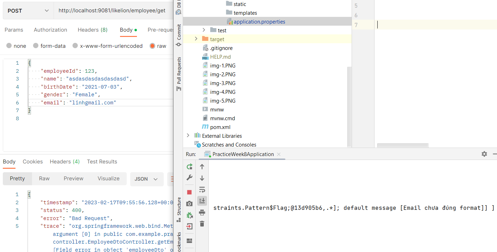
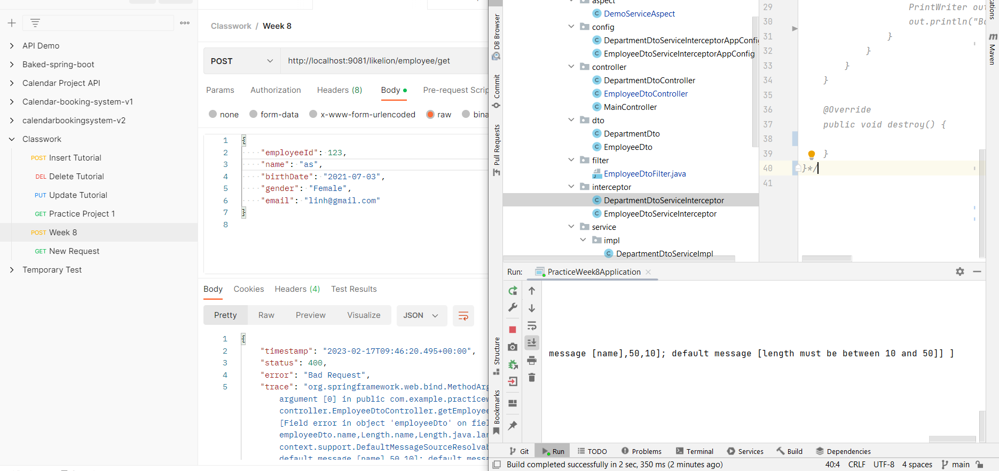
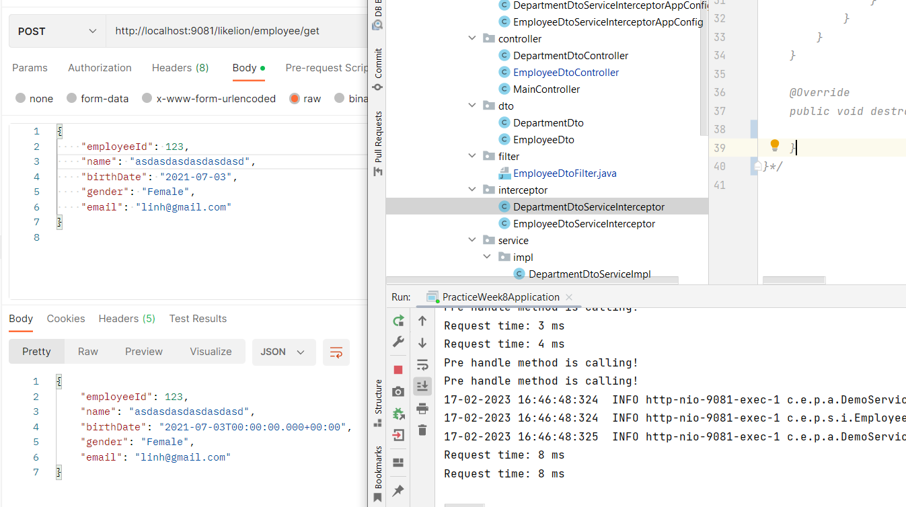
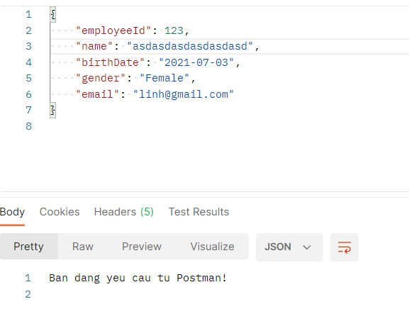
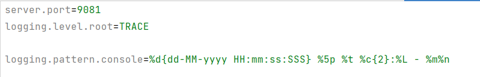

# Practice Week 8

## Results
### Case 1
**Case**: Email sai định dạng    

### Case 2
**Case**: Độ dài name không thỏa    

### Case 3
**Case**: Tính giờ request    

### Case 4
**Case**: Chặn request từ Postman    

### Case 5
**Case**: Level logging và logging pattern    

