# Practice Week 8-3

## Information
**Full name**: Nguyễn Hoàng Linh

## Bài làm
Bài làm ở folder practice-week-8-3-submission

## Results
### Bài 1-1: Test case tầng Repository  
Cho deleteById() fail test case    
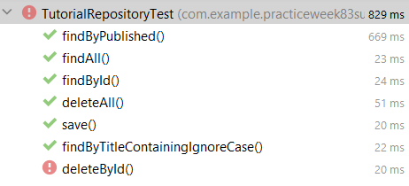  
Cho deleteById() đúng lại với test case    
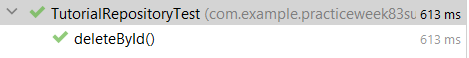  

### Bài 1-2: Test case tầng Service  
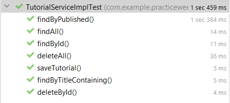    

### Bài 1-3: Test case tầng Controller  
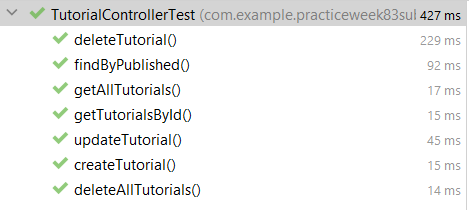    

### Bài 2-1: Sử dụng Actuator  
Thay đổi port quản lý và cài đặt enable cho tất cả các endpoints    
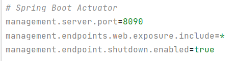    

Truy vấn vào nơi xem các endpoints của ứng dụng    
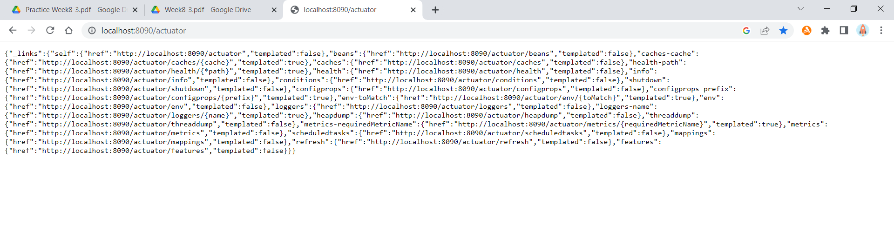    

Truy vấn thông tin sức khỏe của ứng dụng    
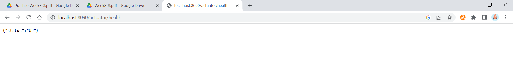    

Shutdown ứng dụng bằng actuator    
&nbsp;&nbsp;&nbsp;&nbsp;a. (Shutdown ứng dụng bằng Postman)    
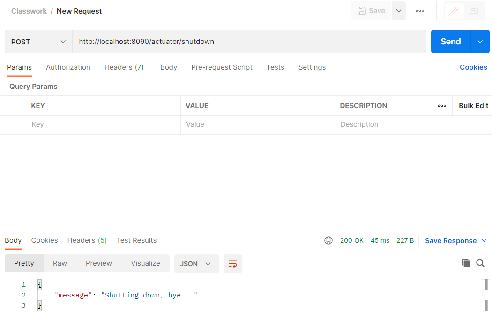    

&nbsp;&nbsp;&nbsp;&nbsp;b. (Kết quả shutdown)    
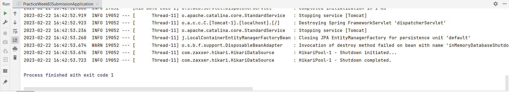    

### Bài 2-2: Sử dụng DevTools (hoặc Actuator)  
Đổi port quản lý giám sát    
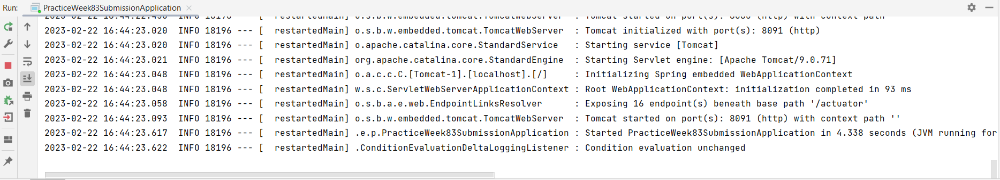    

Truy vấn vào nơi xem các endpoints của ứng dụng bằng port mới đổi    
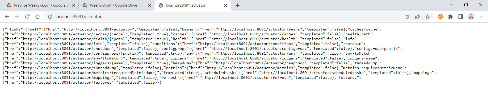

